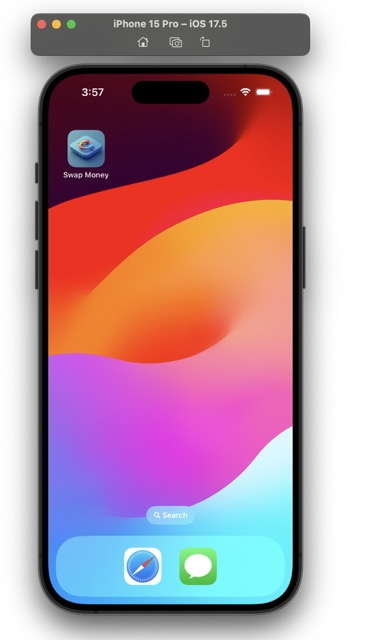
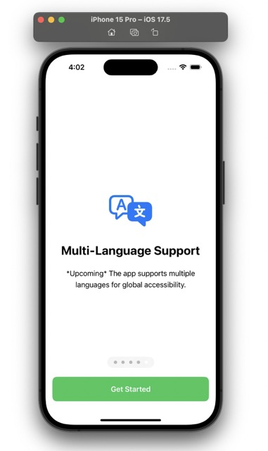
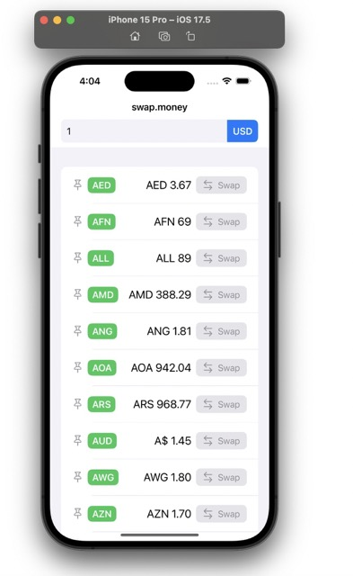
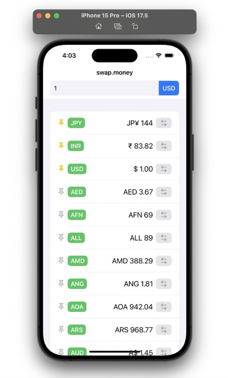

# Swap Money

**Swap Money** is your go-to app for converting currencies effortlessly. Whether you're a traveler or just want to stay on top of exchange rates, Swap Money makes it simple. Enter a value, and you'll instantly see what it's worth across a range of currencies. The app even works offline, making it a reliable companion wherever you are.

## Features

- **Instant Currency Conversion**: Enter once and see the value in multiple currencies at a glance.
- **Pin Your Favorites**: Quickly access the currencies that matter most to you.
- **Works Offline**: Stay updated, even when you’re off the grid.
- **Lightweight Travel Companion**: A simple, powerful tool that’s perfect for travelers.

## Installation

1. Clone this repository to your local machine.
2. Open the `Swap Money.xcodeproj` file in Xcode.
3. Press `Cmd+Shift+O` and search for `OpenExchangeRateAPIConstants`. Update the `apiKey` constant with a valid key from [Open Exchange Rates](https://openexchangerates.org/account). (Sign-up is free!)
4. Build and run the app on a simulator, and you're good to go!

## Minimum System Requirements

- Xcode 15 or later
- macOS Sonoma 14.x or later

## Screenshots

  
*Add Swap Money to your homescreen. It looks good!*

  
*Prime users to various features this app provides.*

  
*Type in a value and see how it converts to different currencies. Change your base currency anytime by tapping on 'Swap' button.*

  
*Pin your favourite currencies at the top.*

## Architecture

Swap Money employs the MVVM-C (Model-View-ViewModel-Coordinator) architecture to ensure a clean separation of concerns.

- **Observable ViewModels** manage business logic, utilizing `@Published` variables to render views in SwiftUI.
- The **Coordinator pattern** facilitates smooth navigation and presentation of different views.
- The ViewModel is built upon a custom internal dependency, **ExchangeRateSDK**, which further relies on components like **PollingService**, **LocalPersistence**, and **Logger**.
- Generic protocol types and dependency injection are employed throughout the project, promoting good practices such as Separation of Concerns, Dependency Inversion, and Liskov Substitution Principles.

## Persistence and APIs

Swap Money leverages the **OpenExchangeRates API** through a NetworkService named **OERService** to fetch real-time currency exchange rates.

Local persistence plays a vital role in storing user preferences, such as the preferred base currency and pinned currency list, as well as complex Codable data structures received from the OERService response.

- The app employs a **LocalPersistence** protocol, implemented by:
  - **FilePersistence**: Utilizing the memento design pattern for file storage.
  - **UserDefaultPersistence**: For storing user defaults.

The **ExchangeRateSDK** utilizes a type-erased protocol implementation called **AnyLocalPersistence**, allowing for runtime switching with feature flags and dependency injection, enhancing code quality and production readiness.

## Planned Features and Improvements

- **Search History**: Keep track of recent conversions for quick access.
- **Offline/Online Indicator**: Visual cues to show when the app is in offline or online mode.
- **Real-Time Conversion API**: Upgrade to real-time exchange rate updates for more accurate conversions.
- **Dark Mode Support**: An improved user experience with a dark mode option.
- **Multi-Language Support**: Localize the app for non-English speaking users.
- **Customizable Themes**: Allow users to personalize the look and feel of the app.

## Credits

This app utilizes only native SDKs. Special thanks to the iOS, Swift, and Apple teams for creating an ecosystem that supports developers like us.
